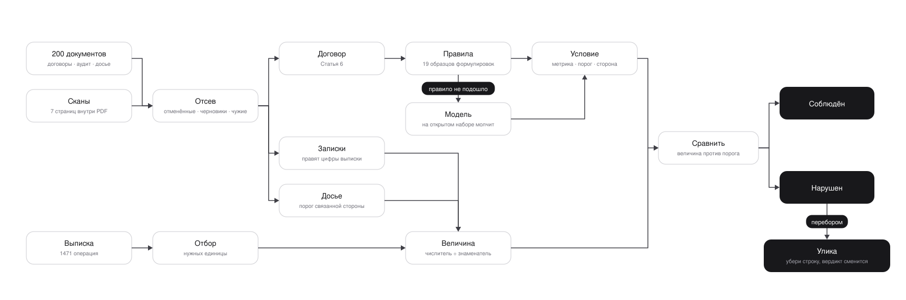

# Проверка ковенантов по кредитным договорам

Решение для Halyk AI Challenge. Агент читает документы заёмщика и банковскую
выписку, находит в договоре финансовые ковенанты, считает по каждому фактическое
значение и выносит вердикт: соблюдён или нарушен.

На открытом датасете решение даёт **35.000 из 36 (97.2%)**. На закрытом, где 27
заёмщиков и 84 ячейки, разбираются все пункты у всех заёмщиков, и ни одно
значение не выходит пустым, нулевым или отрицательным.

<picture>
  <source media="(prefers-color-scheme: dark)" srcset="docs/logic-dark.svg">
  
</picture>

## Как это работает

Верхняя дорожка отвечает на вопрос «что считать», нижняя на вопрос «из чего».
Договор задаёт определение, выписка даёт черновые цифры, а правят их служебные
записки.

**Сначала отсев.** У каждого заёмщика два договора: действующий и отменённый.
Рядом лежат черновики аудитора с пометкой «заменён окончательным отчётом» и
методички, озаглавленные «Комплаенс», внутри которых написано «не является
клиентским досье». Стоит взять не тот документ, и цифры выйдут правдоподобными и
неверными, без единого признака ошибки.

**Правила ведут, модель страхует.** Разбор идёт образцами формулировок. Модель
включается только там, где образец не подошёл. На открытом наборе она не
понадобилась ни разу, на закрытом взяла на себя треть пунктов и почти все
поправки, потому что формулировки там другие.

**Ответ принимается, только если он не противоречит сам себе.** Порог вида
`2.00x` означает отношение, и знаменатель обязателен. Порог в долларах означает
абсолютный лимит, и знаменателя быть не может. Проверка работает в обе стороны,
и несогласованный ответ считается молчанием и уходит модели. Уверенная ошибка
правила опаснее его молчания.

**Считает код, а не модель.** Модель переводит текст пункта в формулу и читает
записки, арифметику ведёт `Decimal`.

**Из выписки берётся одна строка, а не сумма категории.** Из двух с половиной
тысяч операций нужны единицы: та, что покрывает весь период, а не частичное
начисление по площадке.

**Улика ищется вычитанием.** Не «самая крупная строка», а та, при исключении
которой вердикт меняется.

## Запуск

```bash
uv sync
uv run python -m solution.run \
    --dataset <каталог набора> \
    --out out/submission.json \
    --team "<команда>" --email "<почта>" --report
```

`--report` печатает счётчики прогона: сколько документов привязано, сколько
пунктов разобрано, сколько раз сработал каждый вид поправки. На незнакомых
данных смотреть надо сюда, потому что молчаливый провал виден здесь раньше, чем
в самих ответах. Пустое значение при вердикте «соблюдён» это не ответ, а
непойманное молчание правила.

Если у набора есть эталон, добавьте `--score-against` и увидите балл сразу.

Ключи читаются из `.env`: `ANTHROPIC_API_KEY`, `OPENAI_API_KEY`,
`GEMINI_API_KEY`. Достаточно любого одного, провайдеры пробуются по очереди, а
исчерпанный выбывает после трёх отказов и не тянет за собой остальных. Без
ключей прогон тоже проходит, система возвращается к поведению на правилах.

Для распознавания сканов нужен `tesseract` с русским и английским
(`brew install tesseract tesseract-lang`). Сканы спрятаны отдельными страницами
внутри текстовых PDF, и без распознавания часть ячеек посчитать нечем.

## Что оказалось разным в двух наборах

Закрытый набор написан другим генератором, и почти все различия проявились как
показатель, не нашедший ни одной операции, а не как «почти верное» число.

| Различие | Чем грозило |
|---|---|
| договор целиком на английском: `Article V`, `Section 5.1`, `SUPERSEDED` | заёмщик терял все свои ячейки |
| период записан как `from … to …` | пустой год, годовой отбор строк ломался |
| идентификатор операции `TXN-KC-CAP-29` вместо номера в конце | терялись все операции заёмщика |
| номер счёта `TELE-4471` вместо `ACC-####` | документы не привязывались к владельцу |
| «Максимальные расходы по категории»: статья названа в кавычках внутри пункта | считались капзатраты независимо от того, что написано |
| выручка «Mobile service revenue settlement» | утекала в финансирование, EBITDA уходила в минус |
| капзатраты «Kiln conveyor machinery upgrade» | не опознавались дословным шаблоном |
| досье оформлено записями, а не таблицей долей | связанные стороны выходили нулём у трети заёмщиков |

## Проверки

```bash
uv run python -m pytest tests/ -q
```

Тесты следят, чтобы решение не было подогнано под открытый набор: в коде не
должно быть идентификаторов сценариев, номеров счетов и операций, названий
контрагентов и числовых порогов.

Отдельно есть мутационный стенд `tools/mutate.py`. Он переписывает формулировки
в датасете, не меняя смысла, и меряет балл заново. Падение означает, что разбор
держался на конкретном слове, а не на сути.

| Что переписано в документах | Было | Стало |
|---|---:|---:|
| «Пункт 6.1» → «Статья 6.1» | 9.500 | **35.000** |
| маркер недействующей редакции | 9.500 | **35.000** |
| формат даты `2025-01-01` → `01.01.2025` | 34.000 | **35.000** |
| формулировка поправки в записке аудитора | 33.000 | **35.000** |
| название показателя в заголовке пункта | 34.000 | **35.000** |

Первые две строки были единичными точками отказа: одна регулярка роняла всю
систему на пол в 9.500. Сейчас все пять переформулировок проходят без потерь.

## Соответствие правилам

Ответы генерирует агент, одной командой, из исходных PDF и CSV. Готовые агенты
использовались только при разработке. Модель вызывается там, где правило
промолчало: не опознало формулировку пункта, не дало ровно одной действующей
редакции договора, не нашло ни одного образца поправки в записке. Арифметика
всегда на `Decimal`. Распознавание сканов делает `tesseract` локально.
